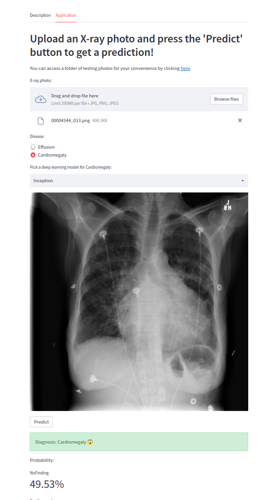

# Bachelor Thesis
## How to run it:
### Create a virtual environment
```
python -m venv venv
source /venv/bin/activate
```
### Install requirements
```
pip install -r requirements.txt
```
### Train models
```
./Cardiomegaly.fish
./Effusion.fish
```
### Run Streamlit app
```
docker compose up
```
## Streamlit Web App ([link](https://marvinhoxha-bachelor-thesis.streamlit.app/))


